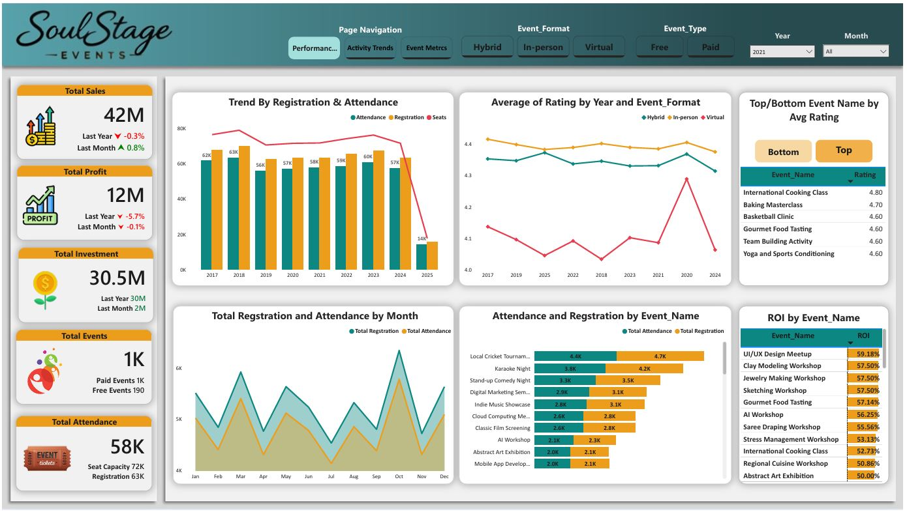

# 🎉 Event Management Analytics Dashboard (Power BI)

## 📌 Project Overview
This project is an **end-to-end Event Management Analytics solution** designed to help event organizers understand **performance, profitability, customer engagement, and operational efficiency**.

The dashboard transforms raw event data into **actionable business insights** using interactive Power BI visuals and structured data modeling.  
It answers key business questions such as:

- Which event formats perform best (**In-Person, Virtual, Hybrid**)?
- Which **cities, states, topics, and organizers** generate the most profit?
- Which event categories have the **highest and lowest average ROI**?
- What are the **Top 10 highest-rated events**?
- Where should the company **invest more or optimize costs**?

---

## 🧰 Tools & Technologies Used
This project was built using a **complete data analyst tool stack**:

- **SQL** → Data extraction, cleaning, joins, transformations  
- **Excel** → Data validation and exploratory analysis
- **PowerPoint** → Visual bsckground presentation  
- **Power BI** → Data modeling, DAX, visualization, dashboarding  

👉 This reflects a **real-world BI workflow**, not just visualization.

---

## 📊 Dashboard Structure
The report is divided into **3 interactive analysis pages**, each answering a specific business question.

### 📈Performance & Growth KPIs
- Designed executive KPIs with MoM & YoY analysis for sales, profit, investment, and attendance.
- Implemented conditional formatting and indicators to highlight performance trends and anomalies.
- Designed KPIs for organizer performance, comparing events, revenue, profit, and ratings.

---

### 🔹 1. Performance Trends
**Purpose:** Understand event performance and customer experience

- Registration vs Attendance trends over time
- Average rating trends by year and event format
- Top & bottom events by customer rating
- Month-wise seasonality of event activity

---

### 🔹 2. Activity Trends
**Purpose:** Analyze sales and profit drivers

- Sales & profit by event category and topic
- ROI by category and location
- City & state-wise event hosting trends
- Investment vs sales comparison over time
- Profitability by event format

---

### 🔹 3. Event Metrics
**Purpose:** Detailed performance comparison

- Event-level performance matrix
- Organizer performance scorecard
- Dynamic comparison of attendance, rating, profit, and ticket price
- Top performer identification

---

## 🧠 Key Skills Demonstrated
This project showcases strong hands-on skills in:

- Star schema data modeling
- Time intelligence (Previous Year, Previous Month)
- KPI design for executive dashboards
- DAX measures & Columns
- Top N & ranking analysis
- Conditional formatting & dynamic visuals

---

## 🎯 Business Impact
This dashboard helps stakeholders to:

- Identify **peak seasons and event demand**
- Improve customer experience using **ratings & attendance insights**
- Optimize investments based on **ROI**
- Evaluate **organizer performance**
- Make **data-driven decisions** for event planning and location strategy

---

## 🖼️ Dashboard Preview

---

## 📌 About Me
I’m a **Data Analyst / BI Developer** with hands-on experience in:

- SQL  
- Excel  
- Power BI  
- Data modeling & business analytics  

I enjoy turning complex data into **clear, meaningful insights** that support business decisions.

📫 *Open to Data Analyst / Power BI Developer opportunities*

---

## ⭐ Support This Project
If you found this project useful, please ⭐ **star this repository** —  
it motivates me to create and share more high-quality analytics projects!

---
